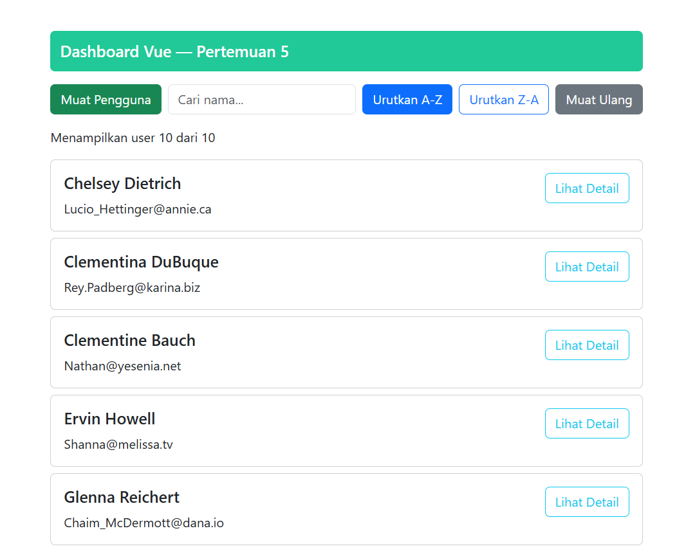
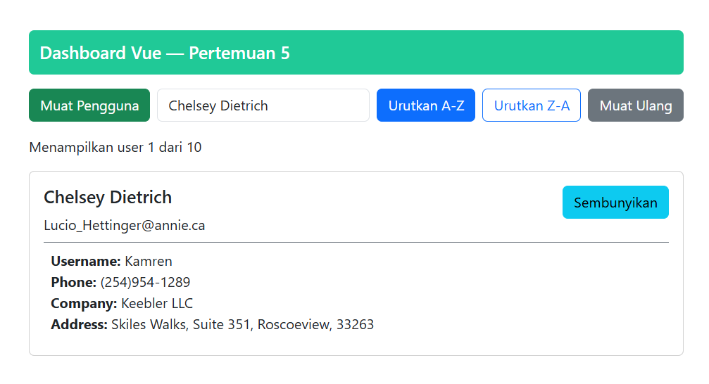

# Dashboard Vue — Pertemuan 5

Dashboard Vue 3 yang memuat data pengguna dari [JSONPlaceholder](https://jsonplaceholder.typicode.com/users). Halaman ini memiliki fitur pencarian, pengurutan, pemuatan ulang, dan tampilan detail pada setiap kartu pengguna.

## Fitur pada `Home.vue`

- **Pencarian:** Nilai input terikat ke `searchInput` menggunakan `v-model`. Saat tombol **Muat Pengguna** diklik, fungsi `searchUsers()` mencegah submit default, membentuk URL dengan parameter `name` yang di-encode melalui `encodeURIComponent()`, lalu memanggil `loadUsers()` untuk mengambil data dari API.
- **Pengurutan:** Tombol **Urutkan A-Z** dan **Urutkan Z-A** mengubah nilai reactive `sortOrder` menjadi `'asc'` atau `'desc'`. `watch(sortOrder, ...)` mendeteksi perubahan tersebut dan menjalankan `sortUsers()`, yang memilih `sortUsersAZ()` atau `sortUsersZA()` untuk mengurutkan array `users` menggunakan `localeCompare()`.
- **Toggle detail:** Setiap objek pengguna memiliki properti `showDetails` yang diinisialisasi `false` saat `loadUsers()` memetakan hasil API. Event `@click="user.showDetails = !user.showDetails"` membalik nilainya, sedangkan `v-if="user.showDetails"` mengontrol rendering informasi detail dan interpolasi teks tombol.
- **Pemuatan ulang dan status:** Fungsi `resetSearch()` mengosongkan `searchInput`, mengembalikan `url` ke endpoint `/users`, lalu memanggil `loadUsers()`. Pada `fetchUsers()`, `isLoading` mengatur spinner sebelum dan sesudah `fetch()`, sementara `errorMessage` diisi ketika response tidak berhasil atau terjadi exception dan ditampilkan melalui `v-if`.

## Cara Menjalankan

Persyaratan: Node.js `22.18+` atau `24.12+`.

```bash
npm install
npm run dev
```

Buka URL lokal yang ditampilkan oleh Vite, biasanya `http://localhost:5173`.

Untuk membuat build production:

```bash
npm run build
npm run preview
```

## Screenshot Hasil Aplikasi

### Daftar pengguna



### Detail pengguna ditampilkan



## Hasil Deployment

[Link Deployment](https://ta-2-wad-05.vercel.app/)
